<!-- README.md is generated from README.Rmd. Please edit that file -->
Background
----------

For the purpose of this analysis, let’s say that we work in the
Marketing or Business Analytics department as a data scientist for the
New York Mets (or even a strategic consulting firm hired by them). I do
not have a particular affinity for the Mets, but I have recently moved
to NYC so I wanted to pick one of the New York teams.

The marketing group likes to use giveaways to drive fan engagement and
satisfaction. A question has come up in a recent meeting regarding the
effect of ballpark giveaways on attendance. The belief is that we see a
boost in attendance during these giveaways and should consider doing
them more often as a means to increase revenue.

Dataset is from the [Marketing
Science](http://www.informit.com/promotions/modeling-techniques-in-predictive-analytics-with-python-141177)
book by Thomas Miller.

For fun, bootstrap regression for the NY Mets and scaled to additional
teams has been added to the end. Only the LA Dodgers show a measurable
impact for bobbleheads when controlling for day of week, month, and
daytime of the game.

Executive Summary
-----------------

While we do see an increase in attendance for games with promotions,
when controlling for month and day of week, we do not see a
statistically meaningful effect on attendance due to promotion. While
this means that promotions may not necessarily drive an increase in
attendance, we can say that it shows we did a good job at selecting
games in which to have promotions since attendance was generally higher
for those games. More fans receiving a promotion will have a better ROI
on engagement for the promotion compared to if we had selected games
with generally lower attendance. More data is needed to validate if our
efforts led to an increasee in fan experience and engagement metrics.

Business Understanding
----------------------

### Goals:

The ultimate goal of the analytics project is to determine if marketing
giveaways have a positive effect on ballpark revenue. In addition to
ticket sales, increasing attendance to the park can affect revenue
streams from parking, merchandise, and concessions. It is possible to
explore how different decisions made within these functions impact
overall game-day revenue, but we will just focus on attendance.

*\[Attendance Prediction\]* A regression model could be built to
determine if marketing promotions increase attendace, when controlling
for other factors such as the day of week, oppoenent, team record, or
weather. If marketing promotions have an impact on attendance, the model
could be used to predict attendance for future games with or without a
marketing promotion. Adding in associated costs, we could estimate the
contribution margin of the promotion and determine which games would
benefit most from the promotion.

Data Understanding
------------------

Each of these potential solutions assumes the data is available to move
forward. To predict attendance for individual games, we will need data
that consists of attendance for home games as well as features
pertaining to the visiting team, weather, day/time, and promotions that
ran. The hypothesis is that attendance is a function of the month, day
of week, time of game, weather, recent performance of the home team,
reputation of the visiting team, and any promotions that are running.

Other factors that could impact attendance include if a particular
pitcher is scheduled to play, winning/losing streaks the team has, or
injuries that prevent star players from being in the lineup. In the case
of the 2012 Mets, they had a pitcher win the CY Young award, so his
starts could have boosted attendance (
[Wikipedia](https://en.wikipedia.org/wiki/2012_New_York_Mets_season)).

Normally, we would query needed data from the database (likely using
SQL). In this case, we are given a dataset that consists of some of the
data we requested. It consists of home games and attendace for the 2012
season along with variables for month, day of week, the opposing team,
some weather information, and whether one of three promotional giveaways
ran (cap, shirt, or bobblehead).

Starting in 2012, the capacity of Citi Field is
[41,922](https://en.wikipedia.org/wiki/Citi_Field).

``` r
# load data
games_all_teams <- read_csv("data/bobbleheads.csv")
```

``` r
# select team of interest
games <- games_all_teams %>%
  filter(home_team == "New York Mets")

games %>% glimpse()
```

    ## Observations: 80
    ## Variables: 14
    ## $ year        <int> 2012, 2012, 2012, 2012, 2012, 2012, 2012, 2012, 20...
    ## $ home_team   <chr> "New York Mets", "New York Mets", "New York Mets",...
    ## $ month       <chr> "APR", "APR", "APR", "APR", "APR", "APR", "APR", "...
    ## $ day         <int> 5, 7, 8, 9, 10, 11, 20, 21, 23, 24, 25, 26, 4, 5, ...
    ## $ attend      <int> 42080, 39526, 27855, 23970, 26927, 34614, 30544, 3...
    ## $ day_of_week <chr> "Thursday", "Saturday", "Sunday", "Monday", "Tuesd...
    ## $ opponent    <chr> "Atlanta Braves", "Atlanta Braves", "Atlanta Brave...
    ## $ temp        <int> 53, 55, 59, 61, 56, 53, 64, 67, 49, 55, 57, 57, 71...
    ## $ skies       <chr> "Clear", "Clear", "Cloudy", "Cloudy", "Cloudy", "C...
    ## $ day_night   <chr> "Day", "Day", "Day", "Night", "Night", "Day", "Nig...
    ## $ cap         <chr> "NO", "NO", "NO", "NO", "NO", "NO", "NO", "NO", "N...
    ## $ shirt       <chr> "NO", "NO", "NO", "NO", "NO", "NO", "NO", "NO", "N...
    ## $ fireworks   <chr> "NO", "NO", "NO", "NO", "NO", "NO", "NO", "NO", "N...
    ## $ bobblehead  <chr> "NO", "NO", "NO", "NO", "NO", "NO", "NO", "NO", "N...

At first glance, we see only 80 home games (opposed to a standard 81)
for the New York Mets in 2012. [Baseball
Reference](https://www.baseball-reference.com/teams/NYM/2012-schedule-scores.shtml)
shows 81 home games, so we’d want to confirm if this is a data error or
due to some other circumstance, such as a home game re-scheduled for
another venue.

We see games pretty evenly dispersed across month and day of week. Most
of the games occurred with cloudy skies or at night. There were 17 total
games with a promotional giveaway.

Using the categorical and numeric summary tables, there were 17 total
opponents with the most games played against teams within the division.
The average temperature for home games was 73 degrees with a high of 94
and low of 49. Most importantly, the average attendace was 28k with a
high that is slightly above capacity. This could be concerning as a data
error, but sometimes attendance is slightly above capacity, so we won’t
raise the alarm bells and can confirm this finding with operations.

``` r
# view counts by categorical variable
games %>%
  select_if(is.character) %>%
  map(~ table(.))
```

    ## $home_team
    ## .
    ## New York Mets 
    ##            80 
    ## 
    ## $month
    ## .
    ## APR AUG JUL JUN MAY SEP 
    ##  12  13  12  13  14  16 
    ## 
    ## $day_of_week
    ## .
    ##    Friday    Monday  Saturday    Sunday  Thursday   Tuesday Wednesday 
    ##        12        11        13        12         9        11        12 
    ## 
    ## $opponent
    ## .
    ##  Arizona Diamondbacks        Atlanta Braves     Baltimore Orioles 
    ##                     3                     9                     3 
    ##          Chicago Cubs       Cincinnati Reds      Colorado Rockies 
    ##                     3                     5                     4 
    ##        Houston Astros   Los Angeles Dodgers         Miami Marlins 
    ##                     3                     3                     9 
    ##     Milwaukee Brewers      New York Yankees Philadelphia Phillies 
    ##                     2                     3                     9 
    ##    Pittsburgh Pirates      San Diego Padres  San Francisco Giants 
    ##                     4                     4                     3 
    ##   St. Louis Cardinals  Washington Nationals 
    ##                     4                     9 
    ## 
    ## $skies
    ## .
    ##  Clear Cloudy 
    ##     11     69 
    ## 
    ## $day_night
    ## .
    ##   Day Night 
    ##    30    50 
    ## 
    ## $cap
    ## .
    ##  NO YES 
    ##  74   6 
    ## 
    ## $shirt
    ## .
    ##  NO YES 
    ##  74   6 
    ## 
    ## $fireworks
    ## .
    ##  NO YES 
    ##  79   1 
    ## 
    ## $bobblehead
    ## .
    ##  NO YES 
    ##  75   5

``` r
# view summary stats for categorical variables via custom function
categorical_summary_pre <- cat_summary_tbl(data = games)

categorical_summary_pre %>%
  mutate(variable = rownames(.)) %>%
  select(variable, everything())
```

    ## # A tibble: 10 x 10
    ##    variable Count `Miss Pct.` Card. Mode  `Mode Freq.` `Mode Pct.`
    ##    <chr>    <dbl>       <dbl> <dbl> <chr>        <int>       <dbl>
    ##  1 home_te…    80           0     1 New …           80       100  
    ##  2 month       80           0     6 SEP             16        20  
    ##  3 day_of_…    80           0     7 Satu…           13        16.2
    ##  4 opponent    80           0    17 Atla…            9        11.2
    ##  5 skies       80           0     2 Clou…           69        86.2
    ##  6 day_nig…    80           0     2 Night           50        62.5
    ##  7 cap         80           0     2 NO              74        92.5
    ##  8 shirt       80           0     2 NO              74        92.5
    ##  9 firewor…    80           0     2 NO              79        98.8
    ## 10 bobbleh…    80           0     2 NO              75        93.8
    ## # ... with 3 more variables: `2nd Mode` <chr>, `2nd Mode Freq.` <int>,
    ## #   `2nd Mode Pct.` <dbl>

``` r
# uncomment to display in HTML table
# kable(categorical_summary
      #,type = "html"
#      ) %>%
#  kable_styling(bootstrap_options = "striped", full_width = F, position = "left", 
#                latex_options = "scale_down")
```

``` r
# view summary stats for numberical variables via custom function
numeric_summary_pre <- num_summary_tbl(data = games)

numeric_summary_pre %>%
  mutate(variable = rownames(.)) %>%
  select(variable, everything())
```

    ## # A tibble: 4 x 11
    ##   variable Count `Miss Pct.` Card.  Min. `1st Qrt.` Median   Mean
    ##   <chr>    <dbl>       <dbl> <dbl> <dbl>      <dbl>  <dbl>  <dbl>
    ## 1 year        80           0     1  2012    2012    2.01e3 2.01e3
    ## 2 day         80           0    29     1       8.75 1.85e1 1.63e1
    ## 3 attend      80           0    80 20010   23944    2.70e4 2.80e4
    ## 4 temp        80           0    33    49      66    7.20e1 7.29e1
    ## # ... with 3 more variables: `3rd Qrt.` <dbl>, Max <dbl>, Std.Dev. <dbl>

``` r
# uncomment to display in HTML table
# kable(numeric_summary
      #,type = "html"
#      ) %>%
#  kable_styling(bootstrap_options = "striped", full_width = F, position = "left", 
#                latex_options = "scale_down")
```

Data Preparation
----------------

To prepare our data for modeling, we’ll first convert our categorical
variables to factors and then create a flag for any games in which a
cap, shirt, or bobblehead was given away to fans. We then re-review our
data to confirm the transformations were completed correctly.

``` r
# create factor levels and convert data
month_levels <- c(
  "APR", "MAY", "JUN", "JUL", "AUG", "SEP"
)

day_levels <- c(
  "Monday", "Tuesday", "Wednesday", "Thursday",
  "Friday", "Saturday", "Sunday"
)

games_tbl <- games %>%
  mutate_if(is.character, as.factor) %>%
  mutate(
    month = month %>% fct_relevel(month_levels),
    day_of_week = day_of_week %>% fct_relevel(day_levels),
    promotion = ifelse(cap == "YES" | shirt == "YES" | bobblehead == "YES", "YES", "NO"),
    promotion = promotion %>% as_factor()
    ) %>%
  select(month, day_of_week, opponent, skies, day_night, promotion, temp, attend)
```

``` r
# review updated levels
games_tbl %>%
  select_if(is.factor) %>%
  map(levels)
```

    ## $month
    ## [1] "APR" "MAY" "JUN" "JUL" "AUG" "SEP"
    ## 
    ## $day_of_week
    ## [1] "Monday"    "Tuesday"   "Wednesday" "Thursday"  "Friday"    "Saturday" 
    ## [7] "Sunday"   
    ## 
    ## $opponent
    ##  [1] "Arizona Diamondbacks"  "Atlanta Braves"       
    ##  [3] "Baltimore Orioles"     "Chicago Cubs"         
    ##  [5] "Cincinnati Reds"       "Colorado Rockies"     
    ##  [7] "Houston Astros"        "Los Angeles Dodgers"  
    ##  [9] "Miami Marlins"         "Milwaukee Brewers"    
    ## [11] "New York Yankees"      "Philadelphia Phillies"
    ## [13] "Pittsburgh Pirates"    "San Diego Padres"     
    ## [15] "San Francisco Giants"  "St. Louis Cardinals"  
    ## [17] "Washington Nationals" 
    ## 
    ## $skies
    ## [1] "Clear"  "Cloudy"
    ## 
    ## $day_night
    ## [1] "Day"   "Night"
    ## 
    ## $promotion
    ## [1] "NO"  "YES"

``` r
# confirm counts
games_tbl %>%
  select_if(is.factor) %>%
  map(~ table(.))
```

    ## $month
    ## .
    ## APR MAY JUN JUL AUG SEP 
    ##  12  14  13  12  13  16 
    ## 
    ## $day_of_week
    ## .
    ##    Monday   Tuesday Wednesday  Thursday    Friday  Saturday    Sunday 
    ##        11        11        12         9        12        13        12 
    ## 
    ## $opponent
    ## .
    ##  Arizona Diamondbacks        Atlanta Braves     Baltimore Orioles 
    ##                     3                     9                     3 
    ##          Chicago Cubs       Cincinnati Reds      Colorado Rockies 
    ##                     3                     5                     4 
    ##        Houston Astros   Los Angeles Dodgers         Miami Marlins 
    ##                     3                     3                     9 
    ##     Milwaukee Brewers      New York Yankees Philadelphia Phillies 
    ##                     2                     3                     9 
    ##    Pittsburgh Pirates      San Diego Padres  San Francisco Giants 
    ##                     4                     4                     3 
    ##   St. Louis Cardinals  Washington Nationals 
    ##                     4                     9 
    ## 
    ## $skies
    ## .
    ##  Clear Cloudy 
    ##     11     69 
    ## 
    ## $day_night
    ## .
    ##   Day Night 
    ##    30    50 
    ## 
    ## $promotion
    ## .
    ##  NO YES 
    ##  63  17

``` r
categorical_summary <- cat_summary_tbl(data = games_tbl)

categorical_summary %>%
  mutate(variable = rownames(.)) %>%
  select(variable, everything())
```

    ## # A tibble: 6 x 10
    ##   variable Count `Miss Pct.` Card. Mode  `Mode Freq.` `Mode Pct.`
    ##   <chr>    <dbl>       <dbl> <dbl> <chr>        <int>       <dbl>
    ## 1 month       80           0     6 SEP             16        20  
    ## 2 day_of_…    80           0     7 Satu…           13        16.2
    ## 3 opponent    80           0    17 Atla…            9        11.2
    ## 4 skies       80           0     2 Clou…           69        86.2
    ## 5 day_nig…    80           0     2 Night           50        62.5
    ## 6 promoti…    80           0     2 NO              63        78.8
    ## # ... with 3 more variables: `2nd Mode` <chr>, `2nd Mode Freq.` <int>,
    ## #   `2nd Mode Pct.` <dbl>

``` r
# # uncomment to display in HTML table
# kable(categorical_summary
      #,type = "html"
#      ) %>%
#  kable_styling(bootstrap_options = "striped", full_width = F, position = "left", 
#                latex_options = "scale_down")
```

``` r
numeric_summary <- num_summary_tbl(data = games_tbl)

numeric_summary %>%
  mutate(variable = rownames(.)) %>%
  select(variable, everything())
```

    ## # A tibble: 2 x 11
    ##   variable Count `Miss Pct.` Card.  Min. `1st Qrt.` Median   Mean
    ##   <chr>    <dbl>       <dbl> <dbl> <dbl>      <dbl>  <dbl>  <dbl>
    ## 1 temp        80           0    33    49         66     72 7.29e1
    ## 2 attend      80           0    80 20010      23944  27032 2.80e4
    ## # ... with 3 more variables: `3rd Qrt.` <dbl>, Max <dbl>, Std.Dev. <dbl>

``` r
# # uncomment to display in HTML table
# kable(numeric_summary
      #,type = "html"
#      ) %>%
#  kable_styling(bootstrap_options = "striped", full_width = F, position = "left", 
#                latex_options = "scale_down")
```

Next we will plot our data to get a better understanding of the
different distributions and relationships to attendance.

**Attendance Histogram** Attendance is mostly right-skewed with most
values between 25-30k. There are a couple games with attendance over
40k.

``` r
games_tbl %>%
  ggplot(aes(x = attend / 1000)) +
  geom_histogram(bins = 30, color = "black", fill = "grey") +
  labs(
    title = "New York Mets Home Attendance (2012)",
    x = "Attendance (1000s)",
    y = "# of Games",
    caption = "Source: MLB League Data"
  )
```

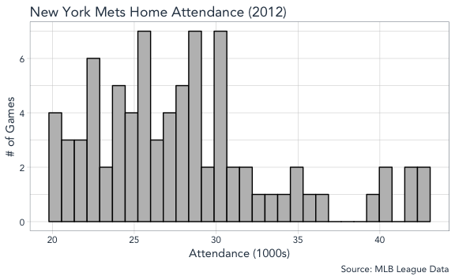

**Promotion Boxplot**

We see a good initial indication in higher attendance associated with
promotion. The boxplot for promotion vs. no promotion shows a slightly
higher distribution for games with promotions.

``` r
games_tbl %>%
  ggplot(aes(x = promotion, y = attend / 1000, color = promotion)) +
  geom_boxplot() +
  scale_color_manual(values = c("grey", "blue")) +
  labs(
    title = "New York Mets Home Attendance (2012)",
    x = "",
    y = "Attendance (1000s)",
    caption = "Source: MLB League Data"
  ) +
  guides(
    color = FALSE
  )
```

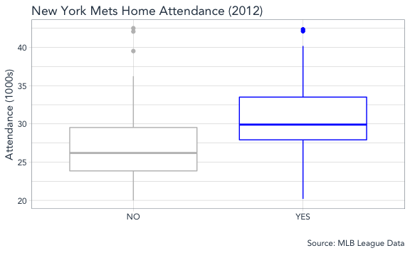

**Month Boxplot**

Our boxplot for attendance across months shows attendance peaking in
June and July with attendance dipping back down in August and September
as the season winds down.

``` r
games_tbl %>% 
  ggplot(aes(x = month, y = attend / 1000)) +
  geom_boxplot() +
  labs(
    title = "New York Mets Home Attendance (2012)",
    x = "",
    y = "Attendance (1000s)",
    caption = "Source: MLB League Data"
  )
```

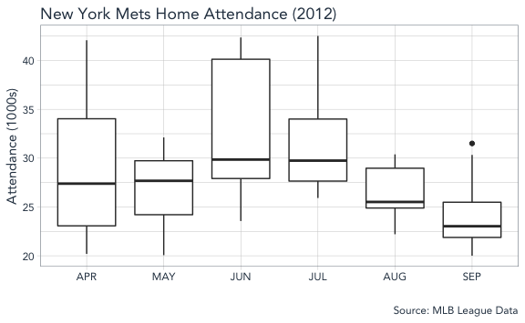

**Day of Week Boxplot**

Our boxplot for attendance across weekdays shows attendance generally
higher on Saturdays with potential outliers on a few of the days.

``` r
games_tbl %>% 
  ggplot(aes(x = day_of_week, y = attend / 1000)) +
  geom_boxplot() +
   scale_x_discrete(
    labels = c("Mon","Tues","Wed", "Thurs", "Fri", "Sat", "Sun")
    ) +
  labs(
    title = "New York Mets Home Attendance (2012)",
    x = "",
    y = "Attendance (1000s)",
    caption = "Source: MLB League Data"
  )
```

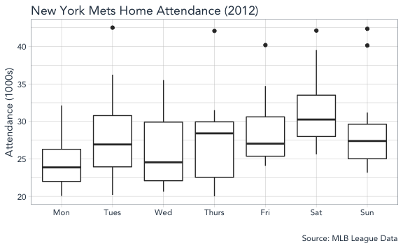

**Day Time Boxplot**

Our boplot for day time of games shows higher attendance for day games
compared to night games.

``` r
games_tbl %>% 
  ggplot(aes(x = day_night, y = attend / 1000)) +
  geom_boxplot() +
  labs(
    title = "New York Mets Home Attendance (2012)",
    x = "",
    y = "Attendance (1000s)",
    caption = "Source: MLB League Data"
  )
```

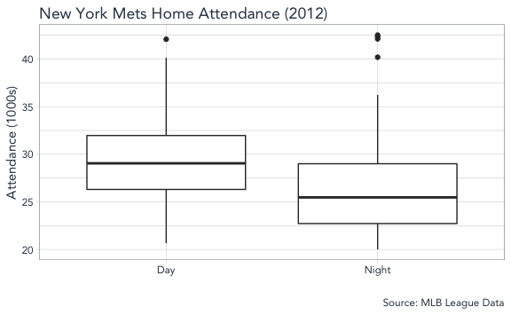

**Skies Boxplot**

Our boplot for the weather/skies of games shows higher attendance for
games with clear skies compared to when it is cloudy.

``` r
games_tbl %>% 
  ggplot(aes(x = skies, y = attend / 1000)) +
  geom_boxplot() +
  labs(
    title = "New York Mets Home Attendance (2012)",
    x = "",
    y = "Attendance (1000s)",
    caption = "Source: MLB League Data"
  )
```

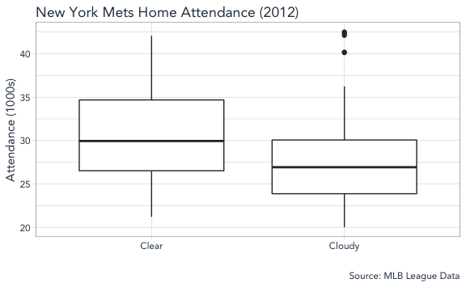

**Day Time by Skies Boxplot**

Interestingly, when we facet the weather conditions by day and night
games, we see night games have potentially higher attendance for cloudy
skies with day games having better attendance for clear skies. This
makes sense as a day baseball game is much more enjoyable in sunshine
than in clouds, and the skies may matter less at night.

``` r
games_tbl %>% 
  ggplot(aes(x = skies, y = attend / 1000)) +
  geom_boxplot() +
  labs(
    title = "New York Mets Home Attendance (2012)",
    x = "",
    y = "Attendance (1000s)",
    caption = "Source: MLB League Data"
  ) +
  facet_wrap(~ day_night, ncol = 2)
```

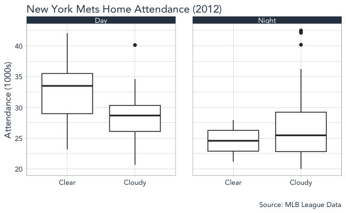

**Temperature and Attendance Scatter Plot**

We don’t see a strong relationship between temperature and game
attendance. When adding color for games with promotions, we do continue
to see that games with promotions appear to have higher attendances.

Adding skies and time of game seem to not add any clarity to the
relationship between temperature and attendance.

``` r
games_tbl %>% 
  ggplot(aes(x = temp, y = attend / 1000, color = promotion)) +
  geom_point(size = 3, alpha = 1/2) +
  scale_color_manual(values = c("grey", "blue")) +
  labs(
    title = "New York Mets Home Attendance (2012)",
    x = "Temperature (F)",
    y = "Attendance (1000s)",
    caption = "Source: MLB League Data",
    color = "Promotion"
  )
```

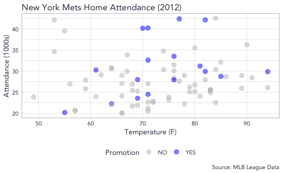

``` r
games_tbl %>% 
  ggplot(aes(x = temp, y = attend / 1000, color = promotion)) +
  geom_point(size = 3, alpha = 1/2) +
  scale_color_manual(values = c("grey", "blue")) +
  labs(
    title = "New York Mets Home Attendance (2012)",
    x = "Teemperature (F)",
    y = "Attendance (1000s)",
    color = "Promotion",
    caption = "Source: MLB League Data"
  ) +
  facet_grid(vars(skies), vars(day_night))
```

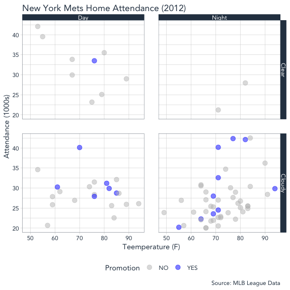

**Opponent Scatter**

When we look at attendance and promotions across different opponents, we
see some oppoenents with no promotion (Atlanta Braves) and some where
all games had a promotion (NY Yankees). Due to the size of our sample
and lack of coverage, this may not be a good predictor to include in its
current form.

``` r
games_tbl %>% 
  mutate(
    opponent = opponent %>%fct_rev()
  ) %>%
  ggplot(aes(x = opponent, y = attend / 1000, color = promotion)) +
  geom_point(size = 3, alpha = 1/2) +
  coord_flip() +
  scale_color_manual(values = c("grey", "blue")) +
  labs(
    title = "New York Mets Home Attendance (2012)",
    subtitle = "By Opponent",
    x = "",
    y = "Attendance (1000s)",
    caption = "Source: MLB League Data",
    color = "Promotion"
  )
```

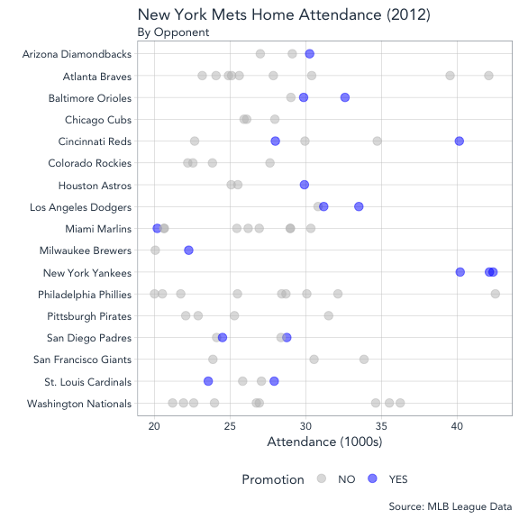

Modeling
--------

Before moving forward with a regression model, we should first check to
see if there is a statistically meaningful increase in attendance for
games with a promotion. To do that, we can simulate a distribution where
there is no difference, and then calculate the probability (p-value) we
would see a difference as extreme or more extreme as the one we see with
our sample.

In doing this, we see a p-value of less than 2%, which is enough to
assert there is a difference in attendance. However, based on our
exploratory analysis, it is possible this difference could have occured
due to other factors and we will want to verify this with a larger
regression model.

``` r
# calculate difference between promotion and no promo
d_hat <- games_tbl %>% 
  group_by(promotion) %>% 
  summarize(mean_stat = mean(attend)) %>%
  summarize(diff(mean_stat)) %>%
  pull()

# use infer package to simulate null hypothesis of no difference
null_distn <- games_tbl %>%
  specify(response = attend, explanatory = promotion) %>%
  hypothesize(null = "independence") %>%
  generate(reps = 10000, type = "permute") %>%
  calculate(stat = "diff in means", order = c("YES", "NO"))

# plot null against observed
null_distn %>%
  ggplot(aes(x = stat)) +
  geom_histogram(bins = 30, color = "black", fill = "grey") +
  geom_vline(xintercept = d_hat, color = "red", linetype = "dashed") +
  annotate("text", x = d_hat + 1100, y = 500, label = "Observed\nDifference") +
  labs(
    title = "Promotion vs. No Promotion Null Hypothesis Simulation",
    subtitle = "10,000 trials",
    x = "Difference in Average Attendance (Promotion - No Promotion)",
    y = "Trials",
    caption = "Source: Simulated Data"
  )
```

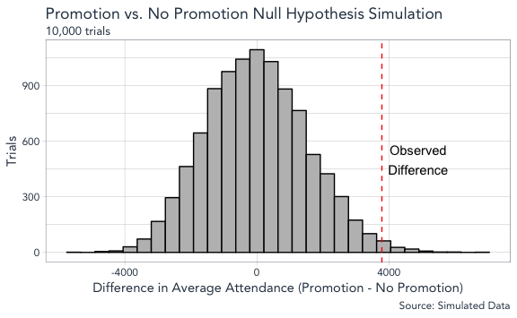

``` r
# calculate proportion of trials with a value as extreme or more
# multiple by two for two-tailed test
p_val <- null_distn %>%
  summarize(p_value = mean(stat >= d_hat) * 2) %>%
  pull()

p_val
```

    ## [1] 0.0172

As a simple first step, we will contruct a regression model using month,
day of week, day time, and promotion as predictors. We can use the
p-value to determine the probability of getting the coefficient (effect)
given there really isn’t an effect on our dependent variable. In this
case, we’ll want to look at both the p-value to determine statistical
significance and coefficient to determine the size of the effect. Since
we log-trnasform our attendance in our model, the coefficient will
inform us of the percentage increase on attendance when a promotion
runs.

Unfortunately, we do not see a statistically meaninful signal being
detected for promotions on attendane.

``` r
# create regression model/summary
mod_form <- as.formula(attend ~ month + day_of_week + day_night + promotion)
full_mod <- lm(mod_form, data = games_tbl)
summary(full_mod)
```

    ## 
    ## Call:
    ## lm(formula = mod_form, data = games_tbl)
    ## 
    ## Residuals:
    ##     Min      1Q  Median      3Q     Max 
    ## -9378.3 -2349.0    60.6  1557.7 12041.7 
    ## 
    ## Coefficients:
    ##                      Estimate Std. Error t value Pr(>|t|)    
    ## (Intercept)             27388       2204  12.427   <2e-16 ***
    ## monthMAY                -1593       1924  -0.828   0.4106    
    ## monthJUN                 5037       2255   2.234   0.0289 *  
    ## monthJUL                 2182       1971   1.107   0.2722    
    ## monthAUG                -2188       1953  -1.120   0.2666    
    ## monthSEP                -3988       1856  -2.148   0.0354 *  
    ## day_of_weekTuesday       4603       2148   2.143   0.0358 *  
    ## day_of_weekWednesday     2080       2024   1.027   0.3079    
    ## day_of_weekThursday      2651       2295   1.155   0.2522    
    ## day_of_weekFriday        3941       2038   1.933   0.0575 .  
    ## day_of_weekSaturday      4770       2391   1.995   0.0502 .  
    ## day_of_weekSunday        2391       2288   1.045   0.2998    
    ## day_nightNight          -2914       1558  -1.871   0.0658 .  
    ## promotionYES            -1003       1805  -0.555   0.5805    
    ## ---
    ## Signif. codes:  0 '***' 0.001 '**' 0.01 '*' 0.05 '.' 0.1 ' ' 1
    ## 
    ## Residual standard error: 4782 on 66 degrees of freedom
    ## Multiple R-squared:  0.4056, Adjusted R-squared:  0.2885 
    ## F-statistic: 3.464 on 13 and 66 DF,  p-value: 0.0004114

Evaluation
----------

The simulation test shows that there is a statistically meaningful
increase in attendance for games with a promotion. Through further
analysis, we could quantify the expected range of attendance increase,
but this is unnecessary as the increase could have been due to
confounding variables like the month or day of week. That is why we then
use the multivariate regression to control for month, day of week, and
day time of the games. When doing that, we no longer see a statistically
detectable effect of promotions on attendance.

Why we see some predictive performance with an adjusted R-squared of
.325, the variation in attendance is generally influenced by games
taking place in June or September, games on Tuesday, Friday, or
Saturday, and games at night versus games in the day time.

We could explore additonal interactions, but our sample size is fairly
small and our initial question has been answered.

Deployment
----------

The takeaway from this is that we were not able to detect an increase in
attendance for games with promotions compared to games without
promotions, when controlling for month, day of week, and time of the
games.

That said, there was a statistically meaningful increase in attendance
for games with promotions, so we did select good games to run a
promotion to impact customer satisfaction and engagement. We would need
additional data to validate if satisfaction was higher due to our
efforts, but the positive takeaway is that productive games were chosen
to run promotions. If we ran promotions on games with a lower on average
attendance, then we would get a reduced potential ROI on our engagement
investment as it would have been made on a smaller number of fans.

Part 2: Bootstrap Resampling
----------------------------

``` r
# set value for number of bootstrap samples to run
bootstrap_n <- 2500
```

As an extension of the problem above, we can further evaluate the
uncertainty of the effect of promotions by bootsrapping our dataset,
fitting the model to each bootstrap resample, and then evaluating the
distribution of the promotion coefficient.

First we create 2500 bootstrap resamples of our dataset while accounting
for the ratio of promotional games. The bootstrap function from resample
also creates an analysis (training) and assessment (test) split for each
bootstrap resample.

``` r
set.seed(420)
# bootstrap the data to understand the uncertainty of our assessment
bt_games_tbl <- bootstraps(games_tbl, times = bootstrap_n, strata = "promotion")
```

Next we will create functions to apply to each resample. The first
function fits a model to the analysis split and then returns predictions
for the assessment split. The second function returns the beta
coefficients for each model.

``` r
# obtains predictions for each bootstrap split
# splits will be the `rsplit` object with the 90/10 partition
holdout_results <- function(splits, ...) {
  # Fit the model to the 90%
  mod <- lm(..., data = analysis(splits))
  # Save the 10%
  holdout <- assessment(splits)
  # `augment` will save the predictions with the holdout data set
  res <- broom::augment(mod, newdata = holdout)
  # Return the assessment data set
  res
}

# obtains model coefficients for each bootstrap split
lm_coefs <- function(splits, ...) {
  ## use `analysis` or `as.data.frame` to get the analysis data
  mod <- lm(..., data = analysis(splits))
  
  mod_coef <- as.tibble(t(coef(mod)))
  
  mod_coef
}
```

Now we can apply the function to generate model coefficients for each
bootstrap.

``` r
# apply coefficient function
bt_games_tbl$betas <- map(.x = bt_games_tbl$splits, 
                          .f = lm_coefs, 
                          mod_form)
```

And return the predictions on the holdout set.

``` r
# apply holdout function
bt_games_tbl$resid <- map(.x = bt_games_tbl$splits, 
                          .f = holdout_results, 
                          mod_form)
```

Then we can evaluate the distribution of the model coefficients. In this
we see that the 95% confidence interval contains 0, so the predictor for
our model is not statistically signficant. The average effect of
promotions on attendance for our bootstrapped models is about -1000
tickets (similar to our single model fit on the original dataset)

``` r
# unnest model coefficients for promotion
bt_promo_coef <- bt_games_tbl %>% 
  select(betas) %>% 
  unnest() %>% 
  select(promotionYES)

# get percentile-based confidence interval for 1000 samples
promo_ci <- bt_promo_coef %>%
  pull() %>%
  quantile(., probs = c(0.025, 0.500, 0.975))

mean_promo <- mean(bt_promo_coef$promotionYES) %>% round(0)

# plot coefficient distribution and CIs
bt_promo_coef %>%
  ggplot(aes(x = promotionYES)) +
  geom_histogram(bins = 30, color = "black", fill = "grey") +
  geom_vline(xintercept = promo_ci[[1]], color = "red", linetype = "dashed") +
  #geom_vline(xintercept = promo_ci[[2]], color = "black", linetype = "dashed") +
  geom_vline(xintercept = promo_ci[[3]], color = "red", linetype = "dashed") +
  labs(
    title = "Promotion vs. No Promotion Bootstrap Effect Distribution",
    subtitle = glue("{bootstrap_n} bootstrap trials average promotional effect: {mean_promo} tickets"),
    x = "Promotion Effect on Attendance",
    y = "Trials",
    caption = "Source: Bootstrapped Data"
  )
```

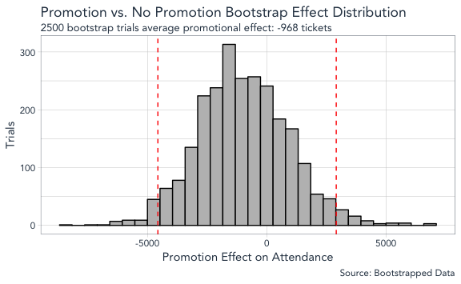

We can also check our coefficient distribution to see the probability
that the promotional effect is greater than 0.

``` r
p_val <- bt_promo_coef %>%
  summarise(p_positive = mean(promotionYES > 0)) %>%
  pull()

print(p_val)
```

    ## [1] 0.2948

The result shows about 29% chance that promotions have a positive
influence on game attendance, after controlling for month, day of week,
and daytime of the game.

Part 3: Extend Bootstrap Regression to Multiple Teams
-----------------------------------------------------

The code below filters teams that have promotions for at least 15 games
and map the linear model to their bootstrapped resamples. Lastly, the
plots of the promotion model coefficient are plotted.

``` r
# create factor levels and convert data
month_levels <- c(
  "APR", "MAY", "JUN", "JUL", "AUG", "SEP", "OCT"
)

day_levels <- c(
  "Monday", "Tuesday", "Wednesday", "Thursday",
  "Friday", "Saturday", "Sunday"
)

# create filter for teams with at least 15 promotions during the season
teams_filter <- games_all_teams %>%
  group_by(home_team) %>%
  filter(cap == "YES" | shirt == "YES" | bobblehead == "YES") %>%
  count() %>%
  filter(n >= 15) %>%
  pull(home_team)

games_all_tbl <- games_all_teams %>%
  filter(home_team %in% teams_filter) %>%
  mutate_if(is.character, as.factor) %>%
  mutate(
    month = month %>% fct_relevel(month_levels),
    day_of_week = day_of_week %>% fct_relevel(day_levels),
    promotion = ifelse(cap == "YES" | shirt == "YES" | bobblehead == "YES", "YES", "NO"),
    promotion = promotion %>% as_factor()
    ) %>%
  select(home_team, month, day_of_week, day_night, promotion, attend)
```

``` r
set.seed(420)
# set number of bootstrap samples
bootstrap_n = 2500

# bootstrap resample data for each team in filtered dataset
bt_all_teams <- games_all_tbl %>%
  group_by(home_team) %>%
  do(bootstraps(., times = bootstrap_n, strata = "promotion"))
```

``` r
bt_all_teams$betas <- map(.x = bt_all_teams$splits, 
                          .f = lm_coefs, 
                          mod_form)
```

``` r
plot_promo_dist <- function(bt_data) {
  
  team <- bt_data$home_team %>% unique()
  
  # unnest model coefficients for promotion
  bt_promo_coef <- bt_data %>% 
    select(betas) %>% 
    unnest() %>%
    select(promotionYES) %>%
    drop_na()
  
  # get percentile-based confidence interval for 1000 samples
  promo_ci <- bt_promo_coef %>%
    pull() %>%
    quantile(., probs = c(0.025, 0.500, 0.975))
  
  mean_promo <- mean(bt_promo_coef$promotionYES) %>% round(0)
  
  # plot coefficient distribution and CIs
  p <- bt_promo_coef %>%
    ggplot(aes(x = promotionYES)) +
    geom_histogram(bins = 30, color = "black", fill = "grey") +
    geom_vline(xintercept = promo_ci[[1]], color = "red", linetype = "dashed") +
    #geom_vline(xintercept = promo_ci[[2]], color = "black", linetype = "dashed") +
    geom_vline(xintercept = promo_ci[[3]], color = "red", linetype = "dashed") +
    labs(
      title = glue("{team} - Bootstrap Promotion Effect Distribution"),
      subtitle = glue("{bootstrap_n} bootstrap trials average promotional effect: {mean_promo} tickets"),
      x = "Promotion Effect on Attendance",
      y = "Trials",
      caption = "Source: Bootstrapped Data"
    )
  
  return(p)
}
```

``` r
for (t in as.character(teams_filter)) {
  bt_all_teams %>%
    ungroup() %>%
    filter(home_team == t) %>%
    plot_promo_dist() %>%
    print()
}
```

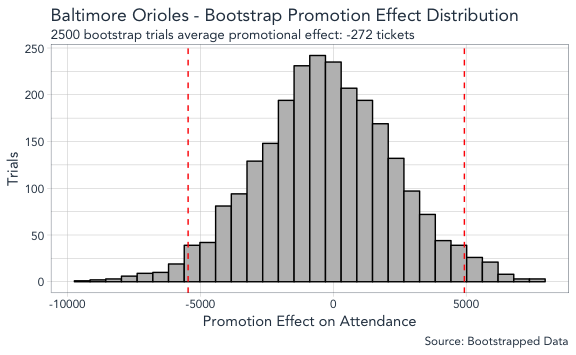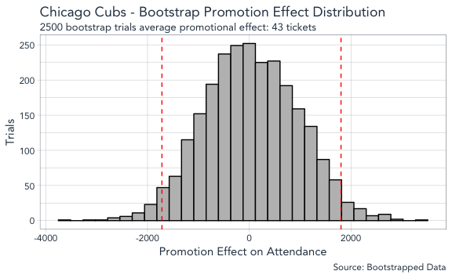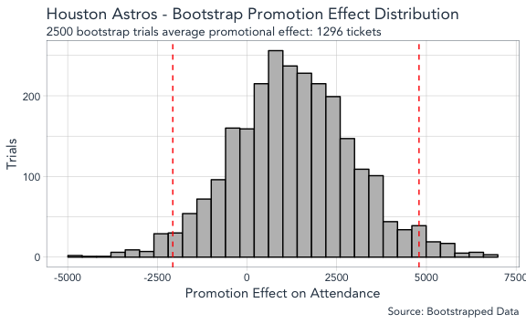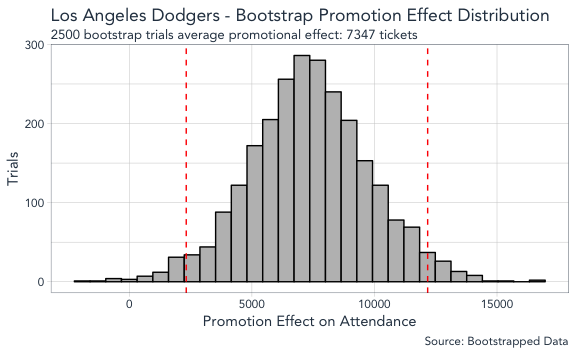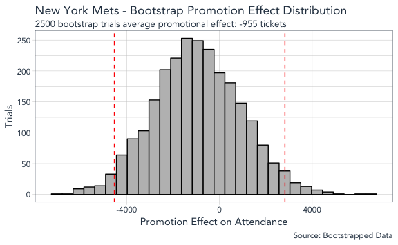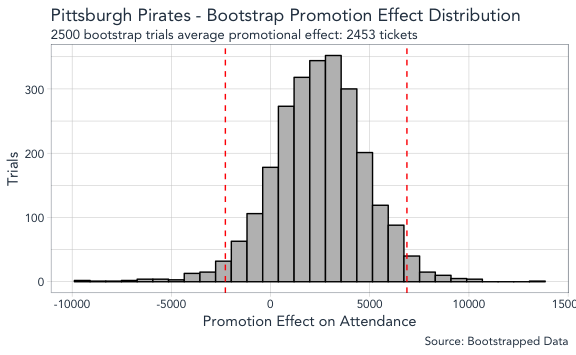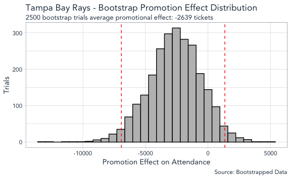
